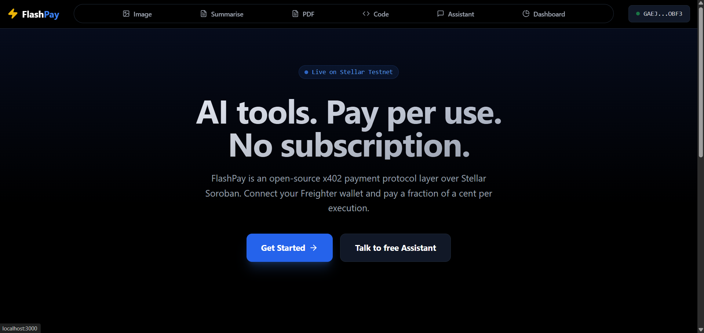
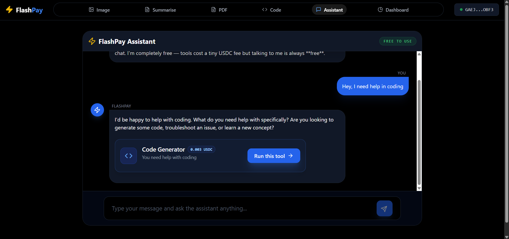
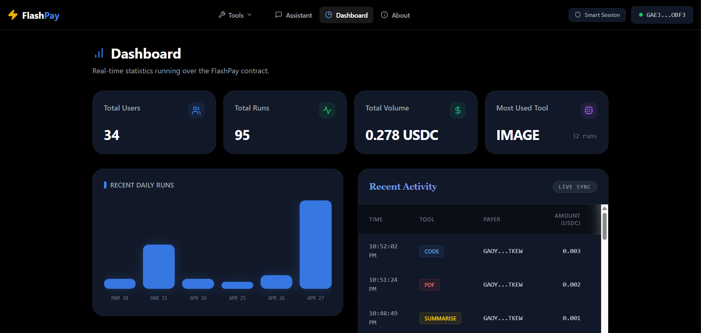
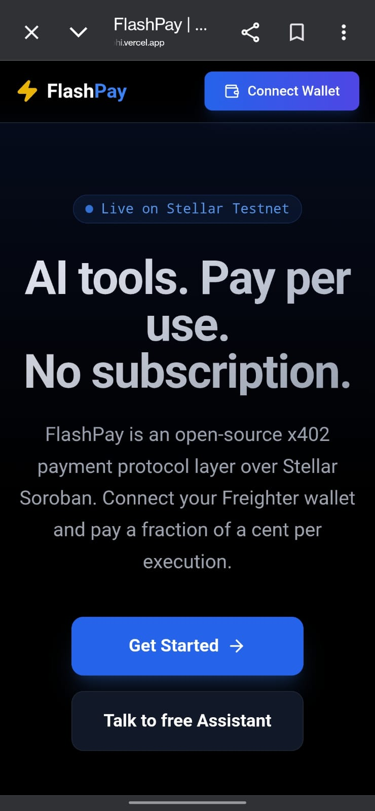

<p align="center">
  <h1 align="center">FlashPay</h1>
  <p align="center"><strong>Pay-Per-Use AI Toolkit on Stellar</strong></p>
  <p align="center">
    AI tools for everyone — no subscription, no account, just Freighter wallet<br/>
    and a fraction of a cent per task, settled on Stellar.
  </p>
</p>

<p align="center">
  <a href="https://github.com/aditya-17-eth/FlashPay/actions/workflows/contracts-ci.yml">
    
  </a>
  <a href="https://github.com/aditya-17-eth/FlashPay/actions/workflows/frontend-ci.yml">
    
  </a>
  <a href="LICENSE">
    
  </a>
  
  
  
  
</p>

---

## What is FlashPay?

FlashPay is a **consumer-facing dApp** where users access AI tools and pay per use via micro-USDC payments on Stellar. No subscription. No credit card. No account creation. Just connect [Freighter wallet](https://www.freighter.app/) and go.

The payment layer uses the **[x402 HTTP payment protocol](https://github.com/coinbase/x402)** (open-sourced by Coinbase) running on a **Soroban smart contract** for trustless USDC escrow — if the AI fails, you get an instant refund.

---

## 🌐 Demo App

🔗 **Live app:** https://flash-payx402.vercel.app/

---

## 🛠️ The Five Tabs

| Tab                | Tool               | Price      | AI Backend                               | What You Provide       |
| ------------------ | ------------------ | ---------- | ---------------------------------------- | ---------------------- |
| `/tools/image`     | 🎨 Image Generator | 0.005 USDC | black-forest-labs/FLUX.1-schnell         | Text prompt            |
| `/tools/summarise` | 📝 Text Summariser | 0.001 USDC | [Groq](https://groq.com) — Llama 3.3 70B | Pasted text + mode     |
| `/tools/pdf`       | 📄 PDF Analyser    | 0.002 USDC | Groq — Llama 3.3 70B                     | PDF upload + question  |
| `/tools/code`      | 💻 Code Generator  | 0.003 USDC | Groq — Llama 3.3 70B                     | Description + language |
| `/assistant`       | 🤖 AI Assistant    | **Free**   | Groq — Llama 3.3 70B                     | Chat message           |

The **AI Assistant** is a free chat that helps users decide which tool to use — it suggests tools via clickable cards but **never fires payments autonomously**.

---

## ⚡ How It Works — x402 Payment Flow

```
1. User clicks action button (Generate / Run / Analyse)
2. Frontend POST → /api/tools/{tool}
3. Backend returns HTTP 402 with price + nonce + contract ID
4. x402 middleware intercepts → Freighter popup: "Approve X USDC?"
5. User approves → Soroban lock_payment() invoked on-chain
6. Frontend polls for tx confirmation
7. Frontend retries request with x-payment-nonce header
8. Backend verifies payment on-chain → calls AI API
9. Backend calls release_payment() (or refund_payment() on error)
10. Result displayed to user
```

**Key guarantee:** If the AI call fails after payment is locked, `refund_payment()` is called immediately — **no funds are ever permanently locked**.

---

## 🏗️ Architecture

```
┌─────────────────────────────────────────────────────────┐
│                    User (Browser)                       │
│  Freighter Wallet  ←→  Next.js 14 Frontend (Vercel)     │
└────────────┬────────────────────────┬───────────────────┘
             │ x402 (HTTP 402)        │ Wallet Sign
             ▼                        ▼
┌─────────────────────┐   ┌──────────────────────────────┐
│  Next.js API Routes │   │  Soroban Smart Contract      │
│  (Serverless)       │   │  (Stellar Testnet)           │
│                     │   │                              │
│  • /api/tools/*     │──▶│  • lock_payment()            │
│  • /api/assistant   │   │  • release_payment()         │
│  • /api/feebump     │   │  • refund_payment()          │
│  • /api/metrics     │   │  • get_stats() / get_users() │
└────────┬────────────┘   └──────────────────────────────┘
         │
    ┌────┴─────┐    ┌──────────┐
    │  Groq    │    │ Supabase │
    │ (LLM)    │    │ (Metrics)│
    └──────────┘    └──────────┘
    ┌──────────┐
    │FLUX.1    │
    │ (Images) │
    └──────────┘
```

---

## 📁 Repository Structure

```
flashpay/
├── contracts/                    # Soroban smart contract (Rust)
│   ├── Cargo.toml
│   └── flashpay-escrow/
│       ├── Cargo.toml
│       └── src/
│           ├── lib.rs            # lock_payment, release_payment, refund_payment, get_stats
│           ├── storage.rs        # Storage key definitions
│           ├── events.rs         # Event emission (lock, release, refund)
│           ├── errors.rs         # Custom contract errors
│           └── test.rs           # 9 unit tests
├── frontend/                     # Next.js 14 App Router
│   ├── app/
│   │   ├── page.tsx              # Landing page
│   │   ├── tools/                # 4 paid tool pages
│   │   ├── assistant/            # Free AI assistant chat
│   │   ├── dashboard/            # Metrics & transaction monitoring
│   │   └── api/                  # 9 API routes (tools, assistant, feebump, metrics, etc.)
│   ├── components/               # Reusable UI (PaymentGate, ChatInterface, etc.)
│   ├── lib/                      # Stellar, Groq, Supabase, Sentry helpers
│   └── middleware.ts             # Rate limiting
├── docs/
│   ├── security.md               # Security checklist
│   ├── architecture.md           # Architecture overview
│   └── x402-spec.md              # x402 protocol specification
├── .github/workflows/
│   ├── contracts-ci.yml          # Rust build + test + testnet deploy
│   └── frontend-ci.yml           # Node build + test + Playwright
├── LICENSE                       # MIT
└── README.md
```

---

## 🧰 Tech Stack

| Layer          | Technology                             | Purpose                                |
| -------------- | -------------------------------------- | -------------------------------------- |
| Smart Contract | Rust + `soroban-sdk 23.4.1`            | Trustless USDC escrow                  |
| Frontend       | Next.js 14, TypeScript, Tailwind CSS 3 | UI + routing                           |
| Wallet         | `@stellar/freighter-api`               | Transaction signing                    |
| Text AI        | Groq API (Llama 3.3 70B) — free tier   | Summarise, PDF, Code, Assistant        |
| Image AI       | black-forest-labs/FLUX.1-schnell       | Image generation                       |
| Database       | Supabase                               | Users, transactions, dashboard metrics |
| Monitoring     | Sentry + Winston                       | Error tracking + structured logging    |
| CI/CD          | GitHub Actions + Vercel                | Auto-test + auto-deploy                |
| Data Fetching  | React Query (TanStack v5)              | Polling, caching                       |
| Charts         | Recharts                               | Dashboard visualizations               |

---

## 📸 Screenshots

Landing Page 
AI Assistant 
Metric Dashboard 

Mobile View



---

## 🎬 Demo Video

> _A walkthrough video demonstrating the full x402 payment flow — from wallet connection to AI tool usage and refund._

🔗 **Video link:** _https://youtu.be/uwUJiIQjnYE_

---

## 🐦 Social Post / Twitter Announcement

> _Read the official launch announcement and thread about FlashPay on Twitter (X)._

🔗 **Twitter Post:**

---

## 🔄 CI/CD Pipelines

The project runs two independent GitHub Actions workflows to ensure quality across the entire stack:

| Workflow                              | Trigger       | What it validates                                                                                                                                                                       |
| ------------------------------------- | ------------- | --------------------------------------------------------------------------------------------------------------------------------------------------------------------------------------- |
| **Frontend CI** (`frontend-ci.yml`)   | Any push / PR | Installs Node.js 20 + pnpm 9, injects mock environment variables, runs `pnpm build` for production bundle, and executes `pnpm test`                                                     |
| **Contracts CI** (`contracts-ci.yml`) | Any push / PR | Installs Rust + `wasm32-unknown-unknown` target, builds each Soroban contract to WASM, runs `cargo test`, and auto-deploys to Stellar Testnet on `main` (when secret key is configured) |

Both pipelines must pass before a pull request can be merged.

---

## 🚀 Quick Start

### Prerequisites

| Tool                                                                                     | Version | Purpose                    |
| ---------------------------------------------------------------------------------------- | ------- | -------------------------- |
| [Node.js](https://nodejs.org/)                                                           | 20+     | Frontend runtime           |
| [pnpm](https://pnpm.io/)                                                                 | 9+      | Package manager            |
| [Rust](https://rustup.rs/)                                                               | stable  | Smart contract compilation |
| [Stellar CLI](https://developers.stellar.org/docs/tools/developer-tools/cli/stellar-cli) | latest  | Contract build & deploy    |
| [Freighter](https://www.freighter.app/)                                                  | latest  | Browser wallet extension   |

### 1. Clone & Install

```bash
git clone https://github.com/aditya-17-eth/FlashPay.git
cd FlashPay
```

### 2. Smart Contract

```bash
# Build the WASM binary
cd contracts
stellar contract build

# Run all 9 unit tests
cargo test

# Deploy to testnet (requires funded keypair)
stellar contract deploy \
  --wasm target/wasm32-unknown-unknown/release/flashpay_escrow.wasm \
  --source-account $STELLAR_SECRET_KEY \
  --network testnet

# Initialize with USDC SAC + your payee wallet
stellar contract invoke \
  --id $CONTRACT_ID \
  --source-account $STELLAR_SECRET_KEY \
  --network testnet \
  -- initialize \
  --usdc_token GBBD47IF6LWK7P7MDEVSCWR7DPUWV3NY3DTQEVFL4NAT4AQH3ZLLFLA5 \
  --payee $YOUR_PUBLIC_KEY
```

### 3. Frontend

```bash
cd frontend

# Copy environment template and fill in your keys
cp .env.local.example .env.local
# Edit .env.local — add: contract ID, Groq API key, Supabase keys, etc.

# Install dependencies
pnpm install

# Start dev server
pnpm dev
```

Open [http://localhost:3000](http://localhost:3000) in a browser with Freighter installed.

### 4. Supabase Setup

Create the following tables in your Supabase project (see [docs/architecture.md](docs/architecture.md)):

- `users` — wallet addresses, first/last seen
- `transactions` — every tool payment with nonce, tool, amount, status
- `metrics_snapshots` — daily rollup for dashboard charts

Enable Row Level Security with public read-only policies.

---

## ⚡ Advanced Feature: Account Abstraction (Smart Sessions)

FlashPay implements account abstraction by facilitating Session-based pre-authorization via on-chain state, solving the primary UX friction of frequent wallet popups for micropayments.

### Flow:

1. **Allocate:** User signs a single transaction via Freighter to deposit a USDC budget into the escrow contract, defining expiration and max allowance per transaction.
2. **Authorize via backend:** The user receives a session key mapped to their wallet.
3. **Execute:** Subsequent AI tool usages deduct from the assigned session budget _without any Freighter wallet popups_. The backend facilitates usage logging directly with Supabase via the pre-approved escrow allowance.

### Benefits:

- **Zero-Friction AI:** Fast, automated generation bypassing 402 waiting states.
- **Micro UI state:** Dedicated 'FlashPay Session Active' dashboard headers notify users of active time limits.
- **Fully local:** Graceful degradation on session expiration returns the user back to standard per-use prompts.

### Links:

- **Contract logic:** `contracts/flashpay-escrow/src/lib.rs` (Reference `create_session` and `lock_payment_session`)
- **Frontend library:** `frontend/lib/session.ts`
- **UI:** `frontend/components/wallet/SessionManager.tsx`

---

## 💬 User Feedback

> _User feedback Excel link: https://docs.google.com/spreadsheets/d/e/2PACX-1vR33BekZJweTjIoPSA-3p9debUNydaUnNTfnB1EtvckJnvZZ55eVFUhCgR0FrR1kbsH9KfKB-aWWE3w/pubhtml_

| User Name          | User Wallet Address                                      | User Email                    | User Feedback                                                                                  | Commit ID |
| ------------------ | -------------------------------------------------------- | ----------------------------- | ---------------------------------------------------------------------------------------------- | --------- |
| Aiman Momin        | GAIXT2BHVEVSXQN7ERT4SBZFKJ35FKJR2LUADLFVHJI7MI7D6WJ42NDE | aimanmomin999@gmail.com       | A tiny free quota or credits could make adoption easier                                        | f8f91bb   |
| KARTIK BOTRE       | GBHA2H7RRFAE5QINGF3BLSZGLPEBTM5EW7A547PJ4E26L4Z7MMLAOJEE | kartikbotre2410@gmail.com     | Image generator Feature is absolutely accurate                                                 | f8f91bb   |
| Spandan Tulse      | GDNK4HM6E2EUC7SSXQ3C5JVQYWAB5IZ4GNMHJ5XRBKD4DZKBJN34D3V5 | spandy205@gmail.com           | Summariser Feature is very useful                                                              | f8f91bb   |
| neel pote          | GBKLRBXJFBC7SFNZ6PWM5WRHKEOD3PONHYE4UY2N6NJEF3BNS2KU65SV | neelpote44@gmail.com          | option to genrate multiple images at once                                                      | f8f91bb   |
| Sarthak Dhere      | GCRYPAQB3TFLQE727TA3R723QIEPTP5KCMP7OMH4HVXNLCEUKPD4AZJP | sarthakdhere0217@gmail.com    | no there where no bugs                                                                         | f8f91bb   |
| Viru Shelke        | GD5II5CFYRMH6ZNL33K3BT74T4WMXRG6EMGPUIEUAXRKUKVQ3A5ZTAPB | indravardhan10@gmail.com      | Could improve the landing page insights                                                        | f8f91bb   |
| Chirag Pardeshi    | GCCIMBD7AHY2WFUV7GXJ37DAVYO2FXK2OIDARUVS4RQRIOUY2ZTQTBKG | chiragpardeshi493@gmail.com   | nice ui preferred                                                                              | ebcc575   |
| Dhruva Mandavkar   | GA5LFJFRZ6356U2UB37NQGOCZJVLF42FZETM3OMPTP2EZ2QQUFCICQBF | dhruvamandavkar10@gmail.com   | A resume analysis checker that checks and rates your resume.                                   | ebcc575   |
| Shubham Bhosale    | GAOJPUXIQQBK4SVA4RYQ2MUKHAUUHHJDFQFHYAYY6M4LO7ULDJO7PXXR | shubhambhosale9833@gmail.com  | Could add more documents formats for ai analysis                                               | ebcc575   |
| Omkar Jagtap       | GALPMWKLCNINAXN6L6Z5MOS2Y2Z4BFTP3MQDUX4A22VAL3WBV3BLQVX3 | omkarjagtap2105@gmail.com     | add a more informative ui                                                                      | ebcc575   |
| Sarthak Kshirsagar | GCCGWE7UVX6W746FFYD55THU2KM4XOT2EJGFRZK4K5KISZDUAIN7VDZG | kshirsagarsarthak9@gmail.com  | PDF tool helps summarize better than anyother tools online                                     | 7f85400   |
| Aniket Bhilare     | GABAKQPPTWRW6QDR7WSNVXO3QA67B3O5EG6P75SOPQK7GATBFRRR3GFS | bhilareaniket2424@gmail.com   | A single wallet signing feature where multiple tools can be used for a limited time or amount. | 7f85400   |
| Thanchan Bhumij    | GCZYQCKPUBOHOL5VONWJOLHNULLTBE5YR7KRH2OK6LZAO4EL6S2QZXYZ | thanchanb@gmail.com           | add better navigation                                                                          | 7f85400   |
| Shantanu Udhane    | GBLAKFNA2MGGK2F6SCPTEWL3HSI7G4CK4BL6XOFTNPHALXMPECLQKP2F | udhaneshantanu@gmail.com      | a security page should be added telling users about how secure the dapp is.                    | 7f85400   |
| yash annadate      | GCFPZLS4FSNHSD5HKVMES2Y26XCLTD3BO2G6EY2NQT4JHGYW6GWTQSJX | yashannadate2005@gmail.com    | options to choose from multiple models for various tools                                       | 7f85400   |
| Kapil Shisodiya    | GA367DTGT5S5UZSFN4M24SWL2OOXYFX5PDFNFRN5ORC4UIAKG3VHBPU5 | kapilshisodiya1308@gmail.com  | need a better about section                                                                    | 7f85400   |
| Purvai Naik        | GB5OKLSWWQIMG4BQCA7QKMOTAVYTZ5KUV7B62LROPEYRPYGUGWRCRKG4 | purvai1246@gmail.com          | needs a how to use                                                                             | 7f85400   |
| Khushi Shinde      | GDUVJHIQJ2MPCUGI2XLDSON6PS5Q4CW2ADOP2BXVZYWS3LHXAAH2LLC7 | shindekhushi892003@gmail.com  | add more features                                                                              | 7f85400   |
| Atharva bamble     | GCYFYUN6Y7PWXVTBMFGBAGZ6MKD2LIOHKRQUGZLXULYTDJVJZFCES72B | atharvabamble@gmail.com       | tracking your limits should be added                                                           | 5f757f6   |
| Akansha patil      | GCU3MRFMKVSV6I6UVEICCS4TON3WA2YNO7URCENEMI7BBE4GLSNYORIX | akankshapatil2099@gmail.com   | Add a logo for recognition                                                                     | 5f757f6   |
| NEEV AGRAWAL       | GD3M2PRHPNWTEV6INIYKDNTE3MWQJ3RWCA6JVG433EQ3ID6MDPYPN7W2 | neevagrawal328@gmail.com      | Add a light and dark theme                                                                     | 5f757f6   |
| Tejashwi Kasture   | GDQRLHQH7OZJI3OJ5HUL7DWGOTFRW734QC3EYJOMET5MVBLTQI4VGRXT | kasturetejaswhi@gmail.com     | add more document formats for tools like pdf analyzer                                          | 5f757f6   |
| Atharva Shinde     | GAC2SOG32Y62BBQCFUTDJSVFJRVMKATMYKPLSBUJFYPN27KYQ5U6IKCT | satharvashinde7551@gmail.com  | give some free tokens to users                                                                 | 5f757f6   |
| Atharva Koyte      | GCPN4OERNLJEXQXNZJ3SMA6PA7EVK5EPQ3IEX22CXX4BXS2FVNOVJ34L | atharva.koyte@mitwpu.edu.in   | Needs a good ui                                                                                | cabc079   |
| Akshay Awasthy     | GARBOAAO2N7WD47ILMIEDJGVQQZDY2TUNUDIGBQHGPPNPEA7GX7MYUGP | akshayawasthy83@gmail.com     | needs better logic for escrow handling                                                         | cabc079   |
| Sneha Pathak       | GDCUYJNELLBR7AN7OB4D56VDCBLBPQIKYUBECQOYMSD3VONNE7NRMITH | sneha.pathak@gmail.com        | more auth login                                                                                | cabc079   |
| Meera Joshi        | GBRGGGVT2IBQUW7CQMTTZWVBGQT7YJM5KLKGQWXJ7OCGY7NZXLIKLUDX | meera.joshi.pune@gmail.com    | extra tools                                                                                    | 4504988   |
| Samar Kudale       | GD7GH6UJRV373QNY2YXGURQS7U5KL44MSIENJVKXHIJDKLTTUGUIP6BL | samarkudale3@gmail.com        | frontend needs better ui                                                                       | 4504988   |
| Ronit Wadkar       | GCXGTYYJKJOO6ARFWSIFWWLRP2OOH77Y3JLPF3RI7WZ7IHPXBNMHS6JM | ronitwadkar68@gmail.com       | summarizing bullet points tool                                                                 | e6b8267   |
| Rajesh Das         | GC22MRKOZK4V7MWH2ARTGNSIFSUSB2GOAZVZ3HZGW3U2ACS5GJVIDL3Y | rajeshdas81@gmail.com         | An about section                                                                               | 98f97f5   |
| Dhruv Patnekar     | GAITQAFXKSZSZCZMTRZUQC4I7IQWBRWH4QZ5E7ER3IGFJKO6MNFYIIQ5 | dhruv.patnekar@gmail.com      | Add a about section page                                                                       | 584960e   |
| Aditya Shisodiya   | GAOYOWIZPQTSN7RXRU27DLO6NOA445CBK55FNB7Z6PQIULJZ2YFETKEW | adityasisodiya56412@gmail.com | And a about section page                                                                       | 59ea4fe   |

---

## 🔒 Security

See the full checklist in [docs/security.md](docs/security.md). Key highlights:

- **Smart Contract:** `require_auth()` on all mutable calls, nonce deduplication, refund on failure
- **Backend:** Server-side price enforcement, Zod validation, rate limiting (20 req/min), PDFs never written to disk
- **Frontend:** Freighter-only key management, Sentry strips wallet addresses, CSP headers
- **Secrets:** All API keys server-side only; `GROQ_API_KEY`, `SUPABASE_SERVICE_ROLE_KEY`, `FEE_SPONSOR_SECRET_KEY` never exposed in client bundle

---

## 🌟 What Makes It Novel

- **First consumer-facing dApp** using x402 HTTP payment protocol on Stellar
- **Real users, real tools, real USDC transactions** — not a demo
- x402 demonstrated in both **human-triggered AND agent-assisted** modes simultaneously
- **Refund mechanism in Soroban** — production-safe, no locked funds on AI failure
- **Groq + Pollinations = zero API cost** during judge review period

---

## 📚 Documentation

- [Architecture Overview](docs/architecture.md) — system design and payment flow
- [Security Checklist](docs/security.md) — smart contract, backend, and frontend security
- [x402 Protocol Spec](docs/x402-spec.md) — HTTP 402 headers and flow

---

## 📜 License

This project is licensed under the [MIT License](LICENSE).

---

<p align="center">
  <strong>FlashPay —  Open Track — MIT License — March 2026</strong>
</p>
